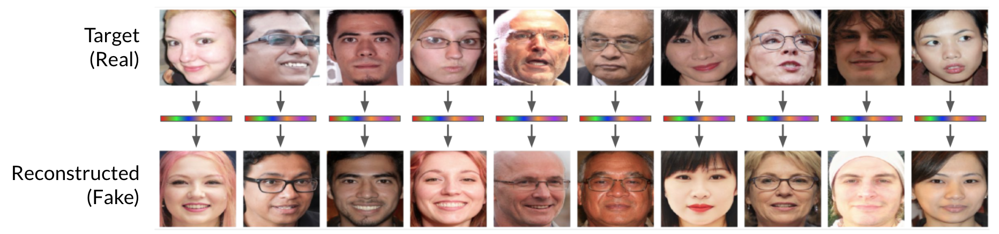

# Realistic Face Reconstruction from Deep Embeddings


**Picture:** *Using just the face embedding of each target image (top row), we accurately reconstruct a face image with is both high-quality and have similarly-perceived identities to the target.*

This is the repository contains the implementation for the paper:

> **Realistic Face Reconstruction from Deep Embeddings**<br>
> Edward Vendrow and Joshua Vendrow.
> 
> **Abstract:** Modern face recognition systems use deep convolution neural networks to extract latent embeddings from face images. Since basic arithmetic operations on embeddings are needed to make comparisons, generic encryption schemes cannot be used. This leaves facial embedding unprotected and susceptible to privacy attacks that reconstruction facial identity. We propose a search algorithm on the latent vector space of StyleGAN to find a matching face. Our process yields latent vectors that generate face images that are high-resolution, realistic, and reconstruct relevant attributes of the original face. Further, we demonstrate that our process is capable of fooling FaceNet, a state-of-the-art face recognition system.

For inquiries, contact [evendrow@stanford.edu](mailto:evendrow@stanford.edu)

## Requirements
_These requirements are still in progress; a `requirements.txt` file will be added soon._
* [StyleGAN2](https://github.com/NVlabs/stylegan2-ada-pytorch) -> Clone into `./stylegan2-ada-pytorch` and downloading `ffhq.pkl`
* [facenet_pytorch](https://github.com/timesler/facenet-pytorch)
* PyTorch and Torchvision

## Usage

Generally speaking, the `main.py` script accepts an image and a set of parameters, converts the image to a FaceNet embedding, then attempts to run the algorithm detailed in the paper to reconstruct a face image from the face embedding. The reconstructed image is saved into `output.png`. Running `python main.py --help` will reveal usage information:

```
usage: main.py [-h] [--setup] [--pregen] [--anneal] [--iters ITERS]
               [--img IMG] [--save_details]

optional arguments:
  -h, --help      show this help message and exit
  --setup         Pregenerate 160k embeddings (stored in the same folder)
  --pregen        Use pregenerated embedding to select a starting location
  --anneal        Use simulated annealing in the reconstruction algorithm (by
                  default, will use greedy algorithm.
  --iters ITERS   Number of iterations
  --img IMG       Image path for reconstruction
  --save_details  Save .pt file with detailed results
```

In order to use pregenerated latent vector, FaceNet embedding) pairs to improve the speed and quality of the algorithm, we must first pregenerate these pairs. To do this, run `python main.py --setup`. This should only be run once. Afterwards, running with the `--pregen` flag will load the pregenerated pairs to improve results.

Best results are achieved when using pregenerated embeddings and when using simulated annealing. For example, to perform this reconstruction routine on some image `face.png`, the command will be:
```
python main.py --img face.png --anneal --pregen
```

## In Progress
This repository is in progress and will be contintually updated. If there are any features you would like, please reach out at the email provided above.
